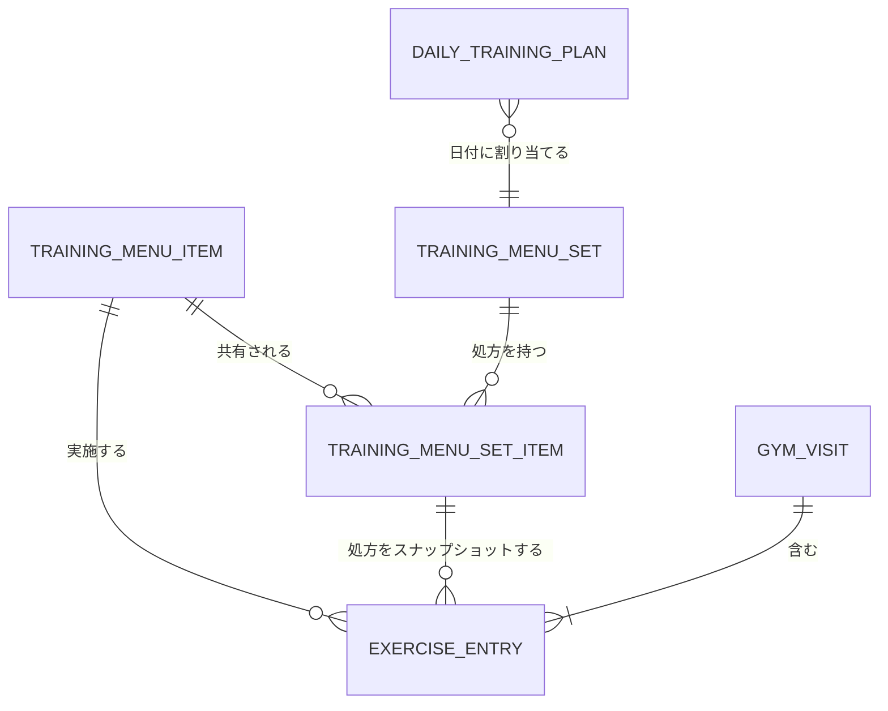

# メニューセット・種目・今日のトレーニング計画 再設計要件

最終更新日: 2026-07-29

## 1. 目的

KinTrain のトレーニング関連データを、次の利用方法に適した構造へ再設計する。

- 種目をユーザー固有のマスタとして一元管理する。
- 同じ種目を複数のメニューセットで共有する。
- 重量、回数、セット数などの目標値をメニューセットごとに設定する。
- AI が既存種目と新規種目を組み合わせて、有効期間付きの一時メニューセットを作成できるようにする。
- 実施画面を開いたときに、対象日のメニューセットを直ちに取得して利用できるようにする。
- 一時的なメニューセットを実施後に削除できるようにする。
- 一時セットや種目定義を削除しても、確定済みの実施履歴は失われないようにする。
- メニューセット管理と種目マスタ管理を分離し、スマートフォンでも直感的に操作できるようにする。

## 2. 用語

### 2.1 種目マスタ（TrainingMenuItem）

トレーニング種目そのものを表す。

- 種目名
- 主働筋・補助筋
- 動作パターン
- 左右の実施方式
- 負荷方式
- 用具
- 説明
- 重量入力方式
- 重量倍率
- バーなどの固定重量
- AI が新規作成した種目か
- 有効状態

重量、回数、セット数、実施頻度などのトレーニング処方は保持しない。

### 2.2 メニューセット（TrainingMenuSet）

複数の種目とその処方をまとめたトレーニング計画を表す。

- `reusable`: 継続利用する恒常的なセット
- `temporary`: 今日など特定用途のために作成する一時セット

### 2.3 セット内種目（TrainingMenuSetItem）

メニューセットと種目マスタの関連、およびそのセットで行う処方を表す。

- 対象種目
- 表示順
- 目標重量
- 目標回数の最小値、最大値
- 目標セット数
- 推奨実施間隔
- セット固有の補足指示

### 2.4 今日のトレーニング計画（DailyTrainingPlan）

ユーザーのローカル日付と、その日に最初に利用するメニューセットの関連を表す。

### 2.5 実施履歴

- `GymVisit`: 1回のジム利用
- `ExerciseEntry`: そのジム利用中に実施した1種目の実績
- `TrainingPerformance`: 種目別履歴参照用に非正規化した実績

## 3. データの関連

## 4. 機能要件

### 4.1 種目マスタ管理

- ユーザーは全種目をセットに依存しない一覧で参照できること。
- 種目名、筋肉ターゲット、用具、状態で検索または絞り込みできること。
- 種目を新規登録、編集、無効化できること。
- 各種目について、利用中のメニューセット数を確認できること。
- 同一ユーザー内で正規化後の種目名を一意とすること。
- 利用中の種目を物理削除しようとした場合は、影響するセット数を表示して確認を求めること。
- 履歴が存在する種目は通常操作では無効化を使用し、履歴は削除しないこと。

### 4.2 メニューセット管理

- ユーザーはメニューセットを一覧表示できること。
- 一覧では名前、種別、作成元、デフォルト状態、種目数を表示すること。
- 恒常セットを新規作成、複製、編集、削除できること。
- 一時セットを手動またはAIで作成、編集、削除できること。
- 恒常セットだけをデフォルトセットに指定できること。
- 1ユーザーにつきデフォルトセットは最大1件とすること。
- 同一セット内に同じ種目を重複登録できないこと。
- 既存の種目マスタを検索し、複数選択してセットへ追加できること。
- セット内の種目ごとに目標重量、目標回数範囲、目標セット数、推奨実施間隔、補足指示を編集できること。
- セット内種目を並べ替えられること。
- 「セットから外す」と「種目マスタを削除する」を明確に区別すること。
- 編集中の入力を項目ごとに即時保存せず、明示的な保存操作でまとめて保存できること。
- 未保存変更がある状態で画面を離れる場合は警告すること。

### 4.3 今日のトレーニング計画

- 1ユーザー、1ローカル日付につき、今日のトレーニング計画を最大1件保持すること。
- 恒常セットまたは一時セットを今日の計画に指定できること。
- 既に計画がある日付へ別セットを指定する場合は、ユーザー確認後に置き換えること。
- 実施画面の初期セットは次の優先順で決定すること。
  1. APIへ明示指定されたセット
  2. 対象日の `DailyTrainingPlan`
  3. デフォルトの恒常セット
  4. 最初の有効な恒常セット
- 一時セットを削除する場合、未実施の `DailyTrainingPlan` も同時に解除すること。
- 確定済み履歴はセット削除の影響を受けないこと。

### 4.4 実施画面

- 画面上部に現在の「今日のメニュー」を表示すること。
- 一時セット、AI作成セットには判別可能なバッジを表示すること。
- 当日の指定がない場合は、既存セットの選択とAI生成への導線を表示すること。
- 各種目に次を分けて表示すること。
  - 一時セットでは「本日の設定」、恒常セットでは「メニューセットの設定」
  - 直近実績
  - 今回の実績入力
- 「設定値を入力」でセット固有の設定値を実績入力へ反映できること。
- 「前回値を入力」で直近実績を反映できること。
- 一時セットの種目は `displayOrder` の昇順で表示すること。
- 恒常セットの種目は `総合順位点 = セット内順位 × 2 + 前回実施からの経過日数順位` とし、点数の小さい順に表示すること。
- 恒常セットで実施履歴がない種目は、前回実施からの経過日数順位で最上位として扱うこと。
- `recommendedIntervalDays` は参考情報として保持し、実施画面の並び替えには使用しないこと。
- 総合順位が同じ場合は、セット内順位が高い種目を先に表示すること。
- 入力途中のドラフトには元の `trainingMenuSetItemId` と目標値を保持すること。
- セット切り替え後も入力済みドラフトを維持すること。
- 同じ種目が異なるセットから入力された場合でも、元の処方を識別できること。
- 保存確認画面に、実績値と使用したセットの設定値を表示すること。
- 一時セットからの実施を保存した後、「一時セットを削除する」操作を提示すること。
- 一時セットは自動削除しないこと。

### 4.5 AIによる今日のメニュー作成

- AIはユーザーの種目マスタ、メニューセット、目標、体調、直近実績を参照できること。
- AIは既存種目の再利用と新規種目の作成を、同じメニューセット内で混在できること。
- 既存種目を使う場合は `trainingMenuItemId` を指定すること。
- 新規種目を使う場合は、種目マスタ定義とセット内処方を分離して指定すること。
- AIは既存の種目マスタや恒常セットを暗黙に変更しないこと。
- AIが作る今日用セットは `temporary` とし、デフォルトセットにしないこと。
- AIは登録前に提案内容を表示し、ユーザーの明示的な登録指示を必要とすること。
- 登録時に次を一連の処理として行うこと。
  1. 必要な新規種目マスタを作成
  2. 一時メニューセットを作成
  3. 既存・新規種目をセットへ追加し、処方を保存
  4. 対象日の `DailyTrainingPlan` に割り当て
- 同一登録要求の再送で重複作成しないよう、冪等性キーを受け付けること。
- 一部だけ登録された状態を残さないこと。
- AIが存在しない既存種目IDや他ユーザーの種目IDを指定した場合は登録を拒否すること。

### 4.6 実施履歴

- `ExerciseEntry` は実績に加え、次の出所情報を保存すること。
  - `sourceTrainingMenuSetId`
  - `sourceTrainingMenuSetNameSnapshot`
  - `sourceTrainingMenuSetItemId`
  - `sourceTrainingMenuSetTypeSnapshot`
  - `targetWeightKgSnapshot`
  - `targetRepsMinSnapshot`
  - `targetRepsMaxSnapshot`
  - `targetSetsSnapshot`
  - `targetInstructionSnapshot`
- 種目名、筋肉ターゲット、動作・負荷分類、用具、重量入力方式など、種目スナップショットを保存すること。
- 元の一時セットまたは種目マスタが削除されても履歴を表示できること。
- `TrainingPerformance` にも、AI分析や種目別履歴で必要な出所・目標スナップショットを複製すること。

## 5. データ要件

### 5.1 TrainingMenuItem

保持する主な属性:

- `userId`
- `trainingMenuItemId`
- `trainingName`
- `normalizedTrainingName`
- `muscleTargets`
- `movementPattern`
- `laterality`
- `loadModel`
- `classificationVersion`
- `equipment`
- `description`
- `weightInputMode`
- `loadMultiplier`
- `fixedWeightKg`
- `isAiGenerated`
- `isActive`
- `createdAt`
- `updatedAt`

従来の次の属性は新モデルでは使用しない。

- `frequency`
- `defaultWeightKg`
- `defaultRepsMin`
- `defaultRepsMax`
- `defaultReps`
- `defaultSets`
- グローバルな `displayOrder`

### 5.2 TrainingMenuSet

追加する属性:

- `setType`: `reusable | temporary`
- `source`: `manual | ai`
- `validFromDate`: 一時セットの有効開始日。開始日を含む。
- `validToDate`: 一時セットの有効終了日。終了日を含む。
- `version`: 楽観ロック用の非負整数。新規作成時は1、旧レコードの未設定値は0として扱う。
- `updatedBy`、`updateReason`: 最終更新の監査情報。
- `canceledAt`、`canceledBy`、`cancelReason`: 論理キャンセル時の監査情報。
- 一時セットは開始日から31日以内とし、同じ日には原則1セットだけ割り当てる。

既存の `isAiGenerated` は `source` へ置き換える。

### 5.3 TrainingMenuSetItem

追加する属性:

- `targetWeightKg`
- `targetRepsMin`
- `targetRepsMax`
- `targetSets`
- `recommendedIntervalDays`
- `instruction`
- `createdBy`: `manual | ai`

制約:

- `targetWeightKg >= 0`
- `targetRepsMin > 0`
- `targetRepsMax >= targetRepsMin`
- `targetSets > 0`
- `recommendedIntervalDays` は1から8
- `instruction` は500文字以内

### 5.4 DailyTrainingPlan

新規テーブル:

- テーブル名: `KinTrain-DailyTrainingPlanTable-{branch}`
- PK: `userId`
- SK: `planDate`（`YYYY-MM-DD`）

主な属性:

- `trainingMenuSetId`
- `source`: `manual | ai`
- `createdAt`
- `updatedAt`

## 6. API要件

### 6.1 種目マスタ

- `GET /training-menu-items`
- `POST /training-menu-items`
- `PUT /training-menu-items/{trainingMenuItemId}`
- `DELETE /training-menu-items/{trainingMenuItemId}`

セット処方に移した項目は種目マスタAPIで受け付けない。

### 6.2 メニューセット

- `GET /training-menu-sets`
- `POST /training-menu-sets`
- `GET /training-menu-sets/{trainingMenuSetId}`
- `PUT /training-menu-sets/{trainingMenuSetId}`
- `DELETE /training-menu-sets/{trainingMenuSetId}`
- `POST /training-menu-sets/{trainingMenuSetId}/items`
- `PUT /training-menu-sets/{trainingMenuSetId}/items/{trainingMenuItemId}`
- `DELETE /training-menu-sets/{trainingMenuSetId}/items/{trainingMenuItemId}`
- `PUT /training-menu-sets/{trainingMenuSetId}/items/reorder`
- `PUT /training-menu-sets/{trainingMenuSetId}/items/bulk`

セット取得時は `itemIds` だけでなく、セット内項目IDと処方を返す。

### 6.3 今日の計画

- `GET /daily-training-plans/{date}`
- `PUT /daily-training-plans/{date}`
- `DELETE /daily-training-plans/{date}`

### 6.4 実施画面

- `GET /training-session-view?date=YYYY-MM-DD&trainingMenuSetId=...`

レスポンスに次を含める。

- 解決されたメニューセット情報
- 今日の計画から解決したか
- セット内項目ID
- セット固有の処方
- 直近実績
- 当日の実施済み種目

### 6.5 AIツール

読取ツール:

- `list_training_menu_items`
- `update_training_menu_item`
- `archive_training_menu_item`
- `list_training_menu_sets`
- `get_training_plan_for_date`
- `get_training_coaching_summary`
- 既存の履歴・Daily・目標参照ツール

登録ツール:

- `create_temporary_training_menu_set_from_ai`
- `reschedule_temporary_training_plan`
- `update_temporary_training_menu_set`
- `cancel_temporary_training_plan`
- `save_daily_meal_notes`（Dailyの自由記述の食事内容・栄養メモを追記または上書き）
- `save_daily_readiness`（就寝・起床日時からの睡眠時間計算と回復状態の部分更新）

更新・キャンセルの詳細は`docs/mcp-temporary-menu-lifecycle.md`を正とする。
種目マスターの検索・更新・アーカイブは`docs/mcp-training-menu-item-lifecycle.md`を正とする。

入力項目の概要:

- `idempotencyKey`
- `validFromDate`
- `validToDate`
- `setName`
- `items`
  - `existingTrainingMenuItemId` または `newTrainingMenuItem`
  - `prescription`

## 7. 削除規則

- メニューセット削除時は `TrainingMenuSetItem` を削除する。
- そのセットを参照する未実施の `DailyTrainingPlan` を削除する。
- `GymVisit`、`ExerciseEntry`、`TrainingPerformance` は削除しない。
- 種目マスタ削除時はセットとの関連を削除するが、履歴は削除しない。
- デフォルトセットは、別の恒常セットをデフォルトにするまで削除できない。
- 一時セットはデフォルトにできない。
- AI登録の途中失敗時は、作成途中のデータを残さない。

## 8. 既存データ移行

既存データの移行は必須とする。後方互換ロジックは常設しない。

### 8.1 移行内容

各既存 `TrainingMenuSetItem` について、参照先 `TrainingMenuItem` から次をコピーする。

- `defaultWeightKg` → `targetWeightKg`
- `defaultRepsMin` → `targetRepsMin`
- `defaultRepsMax` → `targetRepsMax`
- `defaultSets` → `targetSets`
- `frequency` → `recommendedIntervalDays`
- `createdBy` → 元種目の `isAiGenerated` に応じて `ai` または `manual`

各既存 `TrainingMenuSet` には次を設定する。

- `setType = reusable`
- `source = isAiGenerated ? ai : manual`

移行完了後、種目マスタ上の旧処方属性はアプリケーションから使用しない。

### 8.2 実行要件

- ユーザーを明示指定して実行できること。
- `--dry-run` を提供すること。
- 移行済みデータへ再実行しても結果が変わらないこと。
- 対象件数と更新件数を表示すること。
- 本番データ移行はアプリケーションのデプロイ前にバックアップとdry-runを行うこと。

## 9. UI要件

### 9.1 メニュー管理トップ

タブ:

- `メニューセット`
- `種目一覧`

### 9.2 メニューセット一覧

- セットカードまたは一覧行を表示する。
- `恒常`、`一時`、`AI作成`、`デフォルト`をバッジ表示する。
- 新規作成時は空セット作成または既存セット複製を選べること。
- 一時セットは主な利用日を表示すること。

### 9.3 メニューセット編集

- セット基本情報
- 既存種目の検索・複数追加
- セット内処方の編集
- 並べ替え
- 保存、変更破棄

スマートフォンではセット内種目を折りたたみカードとして表示し、種目名と目標値要約を常時確認できること。

### 9.4 種目一覧

- 検索
- 筋肉ターゲット、用具、有効状態による絞り込み
- 新規登録
- 編集
- 無効化
- 使用セット数表示

## 10. 非機能要件

- 全APIで認証済みユーザーの `sub` をデータ所有者として使用すること。
- 他ユーザーの種目、セット、今日の計画を参照または変更できないこと。
- 一覧取得にDynamoDB `Scan` を使用しないこと。
- AI登録は冪等であること。
- スマートフォンで主要操作を片手で行えること。
- 保存失敗時は未保存の入力を保持し、再試行できること。
- 既存の1回最大12種目制限を維持すること。

## 11. 受入条件

- 同じ種目を2つのセットに登録し、異なる目標重量・回数・セット数を保存できる。
- 一方のセットの処方を変更しても、もう一方のセットの処方は変わらない。
- 種目名や説明を変更すると、その種目を参照する各セットで新しい種目情報が表示される。
- AIが既存種目と新規種目を混在させた一時セットを作成できる。
- AI作成後に実施画面を開くと、その一時セットが今日のメニューとして表示される。
- 実施画面でセットの設定値と直近実績を区別して確認できる。
- 実績保存後に一時セットを削除できる。
- 一時セット削除後も履歴にセット名、目標値、実績値が表示できる。
- メニューセットに属していない種目を種目一覧から管理できる。
- 既存データ移行後、既存セットが移行前と同じ重量・回数・セット数で表示される。

## 12. 実装・リリース方針

- 専用ブランチで実装し、現行 `main` からいつでも切り戻せるようにする。
- 要件、バックエンド、フロント、移行スクリプト、テストを分割してコミットする。
- 実データ移行はコード実装とテスト完了後に別作業として実施する。
- デプロイ順序は次とする。
  1. バックアップ
  2. 移行スクリプトのdry-run
  3. 新バックエンドとテーブルのデプロイ
  4. 既存データ移行
  5. 新フロントエンドのデプロイ
  6. 受入確認
